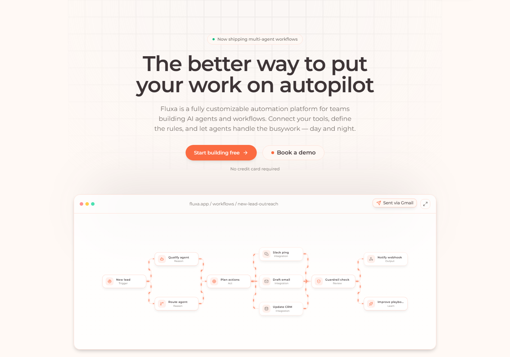

# Fluxa

**Autonomous agents. Automated work.**

A customizable automation platform for teams building AI agents and workflows.

## About

Fluxa lets teams put repetitive work on autopilot. You connect the tools you already use, describe what "done" looks like, and AI agents reason, act, and hand off across chat, email, and internal tools without babysitting. Workflows run day and night, and a human is only pulled in when it matters.

## How it works

1. **Connect your tools.** Plug Fluxa into your inbox, CRM, docs, and databases in seconds.
2. **Set the rules.** Define triggers, guardrails, and approval flows in plain language.
3. **Let agents run.** Agents reason, act, and hand off continuously.

Every workflow follows the same loop: **Trigger → Reason → Act → Review → Learn**.

## Features

- **No-code workflow builder:** drag, drop, and connect steps. Branch, loop, and retry with no glue code.
- **Multi-agent orchestration:** compose specialist agents into one pipeline that plans, delegates, and reviews its own work.
- **24/7 autonomous ops:** escalation rules page a human only when it matters.
- **Guardrails built in:** approval gates, audit trails, and role-based access in every workflow.
- **Wide integrations:** chat, code repos, email, databases, webhooks, calendars, spreadsheets, billing, and project boards.
- **Usage-based pricing:** pay for what your agents actually run.
- **Authentication flows:** sign in, sign up, email verification, and password recovery.

## Built with

Next.js, React, TypeScript, Tailwind CSS, and Framer Motion.

## Source code

The source code for Fluxa is private. This repository is a public showcase only.
